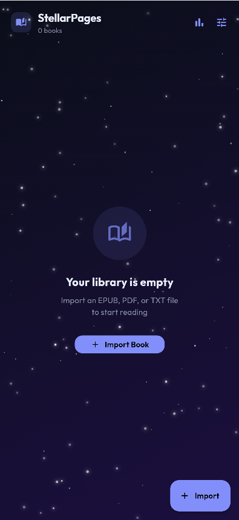
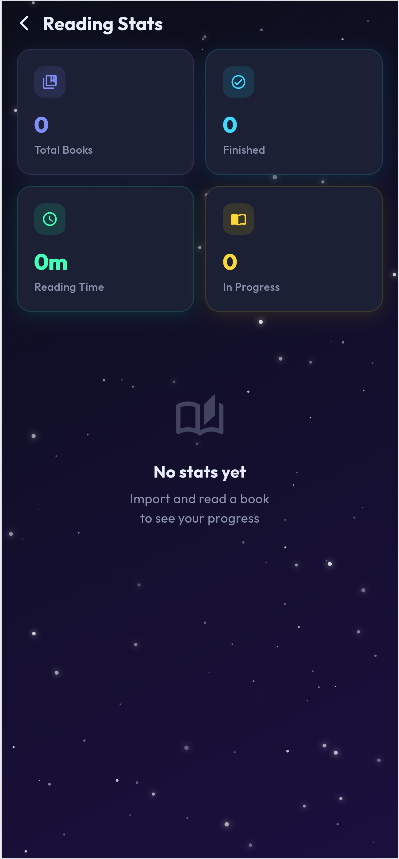
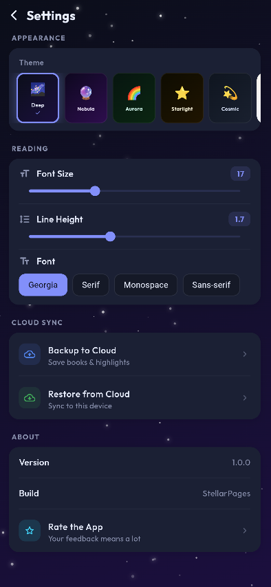

# 🌌 StellarPages - Ebook Reader

<p align="center">
  
  &nbsp;&nbsp;&nbsp;
  
  &nbsp;&nbsp;&nbsp;
  
</p>

<p align="center">
  <b>A universe of stories at your fingertips.</b><br/>
  A beautiful, offline-first ebook reader with 10 space-themed skins, cloud sync, TTS, and more.
</p>

<p align="center">
  
  
  
  
</p>

---

## ✨ What is StellarPages?

StellarPages is a **Flutter-based ebook reader** inspired by Moon+ Reader, built with a space theme throughout. You can import EPUB, PDF, and TXT files, read them offline, customize fonts and themes, and sync your library to the cloud.

Think of it as your personal reading universe - every book is a star.

---

## 📸 Screenshots

| Home  | Reading Stats | Settings |
|:---:|:---:|:---:|
|  |  |  |

---

## 🚀 Features

### 📚 Reading
| Feature | Details |
|---|---|
| **EPUB Support** | Full EPUB & EPUB3 rendering with chapter navigation |
| **PDF Viewer** | Smooth page-by-page PDF reading |
| **TXT Reader** | Clean scrollable plain text view |
| **Auto-Scroll** | 5 speed levels - hands-free reading |
| **Text-to-Speech** | App reads your book aloud |
| **Font Controls** | Adjust size, line height, and font family |
| **Volume Key Paging** | Turn pages with volume buttons (Android) |

### 🎨 Themes (10 total)
| Theme | Vibe |
|---|---|
| 🌌 Deep Space | Dark blue - the default |
| 🔮 Nebula | Purple & pink |
| 🌈 Aurora | Teal & green |
| ⭐ Starlight | Dark gold |
| 💫 Cosmic Dust | Blue-grey |
| 🌅 Sunrise Planet | Light / Day mode |
| 📜 Old Galaxy | Sepia / Warm |
| 🔴 Mars | Dark red |
| ⚫ Black Hole | Pure black AMOLED |
| 🌿 Galaxy Mint | Dark mint |

### 🔖 Library Management
- Import books from your device storage
- Beautiful book grid with cover art and progress bars
- Long-press a book for options (details, remove)
- Reading progress saved automatically

### ☁️ Anti-Gravity Cloud (Cloud Sync)
- Sync your books, bookmarks, and highlights to **Google Drive**
- Restore your full library on any device
- Powered by **Firebase** backend
- Works seamlessly in the background

### 📊 Reading Stats
- Total books read
- Total reading time
- Per-book progress tracking
- Currently reading vs finished

### 🔖 Bookmarks & Highlights
- Add bookmarks with custom notes
- Long-press text to highlight passages
- 4 highlight colors (yellow, green, blue, pink)
- All saved locally with Hive database

---

## 🛠 Tech Stack

| Layer | Technology |
|---|---|
| **Framework** | Flutter 3.x (Dart) |
| **EPUB Rendering** | `epub_view` |
| **PDF Rendering** | `syncfusion_flutter_pdfviewer` |
| **Local Database** | `hive` + `hive_flutter` |
| **Cloud Backend** | Firebase + Google Drive API |
| **State Management** | `provider` (ChangeNotifier) |
| **File Picker** | `file_picker` |
| **Text-to-Speech** | `flutter_tts` |
| **Auth** | `google_sign_in` |

---

## 📁 Project Structure

```
lib/
├── main.dart                     # App entry point & Firebase init
├── models/
│   ├── book_model.dart           # Book, Bookmark, Highlight data models
│   └── book_model.g.dart         # Hive adapters (auto-generated)
├── themes/
│   └── app_themes.dart           # All 10 space themes with full color schemes
├── utils/
│   └── app_state.dart            # Global state - books, settings, bookmarks
├── widgets/
│   ├── starfield_background.dart # Animated twinkling star background
│   └── book_card.dart            # Book card with cover + progress bar
└── screens/
    ├── bookshelf_screen.dart     # Home screen - book library grid
    ├── reader_screen.dart        # Full reader - EPUB/PDF/TXT + controls
    ├── settings_screen.dart      # Themes, fonts, cloud sync settings
    └── stats_screen.dart         # Reading statistics dashboard
```

---

## ⚡ Quick Start

### Prerequisites
- Flutter 3.x installed → [Get Flutter](https://flutter.dev/docs/get-started/install)
- Android Studio (for Android builds)
- Git

### 1. Clone the repo
```bash
git clone https://github.com/Salman-Sensei/StellarPages.git
cd StellarPages
```

### 2. Install dependencies
```bash
flutter pub get
```

### 3. Run the app
```bash
# On Chrome (quick preview)
flutter run -d chrome

# On Android phone (recommended)
flutter run -d android

# List available devices
flutter devices
```

---

## 📦 Dependencies

```yaml
epub_view: ^4.3.0                    # EPUB rendering
syncfusion_flutter_pdfviewer: ^25.x  # PDF rendering
file_picker: ^8.0.0                  # Import files from device
hive: ^2.2.3                         # Local NoSQL database
hive_flutter: ^1.1.0                 # Hive Flutter integration
flutter_tts: ^4.0.2                  # Text-to-speech
firebase_core: ^3.3.0                # Firebase backend
google_sign_in: ^6.2.1               # Google auth for cloud sync
provider: ^6.x                       # State management
percent_indicator: ^4.2.3            # Progress bars
uuid: ^4.x                           # Unique book IDs
```

---

## 🗺 Roadmap

- [x] EPUB / PDF / TXT reader
- [x] 10 space themes
- [x] Bookmarks & notes
- [x] Reading stats
- [x] Text-to-speech
- [x] Auto-scroll
- [x] Firebase cloud sync
- [ ] Dictionary (tap any word)
- [ ] Full highlight system
- [ ] Volume key paging
- [ ] Play Store release
- [ ] iOS support

---

## 🤝 Contributing

Pull requests are welcome! For major changes, open an issue first.

1. Fork the repo
2. Create your branch: `git checkout -b feature/amazing-feature`
3. Commit: `git commit -m "Add amazing feature"`
4. Push: `git push origin feature/amazing-feature`
5. Open a Pull Request

---

## 📄 License

MIT License - feel free to use, modify, and distribute.

---

<p align="center">
  Built with 💙 Flutter &nbsp;|&nbsp; 🌌 StellarPages
</p>
